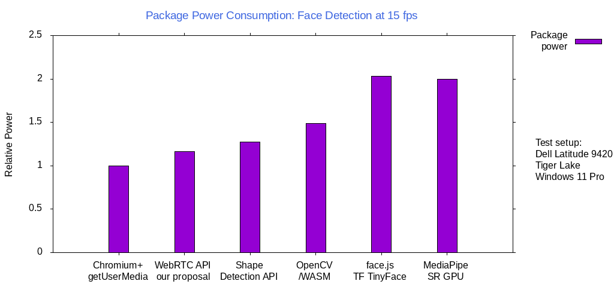

# Face Detection

## Authors:

- Rijubrata Bhaumik, Intel Corporation
- Tuukka Toivonen, Intel Corporation
- Eero Häkkinen, Intel Corporation

## Participate
- github.com/riju/faceDetection/issues/

## Introduction

Face Detection is the process of detecting human faces in a given scene and distinguishing them from other objects. There are multiple ways to perform face detection on the Web. Libraries and ML frameworks (with WebAssembly and WebGL backend) exist, both proprietary and open source, which can perform  face detection either in client within the browser or using a vendor cloud service. Computation in vendor cloud adds latencies depending on network speed and adds dependency to third party service. 

[Shape Detection API has a FaceDetector](https://wicg.github.io/shape-detection-api/) which enables Web applications to use a system provided face detector, but it requires image data to be provided by the Web app itself. It surely helps that it works on images to detect faces, but from a video conference perspective, it means the app would first need to capture frames from a camera and then feed them as input to the Shape Detection API. Many platforms offer a camera API which can perform face detection directly on image frames from the system camera. Cameras run a face detection algorithm by default to make their 3A algorithms work better. Both Microsoft and ChromeOS offer native platforms APIs to hook into those algorithms and offer performant face detection to the Web.


## Goals 

* Face Detection API should be anchored to [VideoFrame](https://www.w3.org/TR/webcodecs/#videoframe-interface) defined in WebCodecs instead of [MediaStreamTrack](https://www.w3.org/TR/mediacapture-streams/#dom-mediastreamtrack).

* Face Detection API should be anchored to [VideoFrameMetadata](https://wicg.github.io/video-rvfc/#dictdef-videoframemetadata) defined in [HTMLVideoElement.requestVideoFrameCallback](https://wicg.github.io/video-rvfc/).

* Face Detection API should try to return a **contour** instead of a bounding box. The number of points describing the contour  can be user defined via **faceDetectionMode** settings and implementations presently can default to a four point rectangle.

* Face Detection API should allow face tracking.

* Face Detection API should work with [TransformStream](https://developer.mozilla.org/en-US/docs/Web/API/TransformStream).

* Face Detection API could be used as an input to various other APIs like Background Blur, Eye Gaze Correction, Face Framing, etc. Face Detection minimizes the surface area other dependent features need to work on for a faster implementation. It should be easy to use Face Detection API along with a custom Eye Gaze Correction or a Funny Hats feature from a ML framework by passing the face coordinates.

* In the spirit of successive enhancement, it should be possible to get results from Face Detection API and add custom enhancements before feeding the metadata to the video stream.

* Facial Landmarks like *eyes*, *nose* and *mouth* should be detected if there's support in the platform.

## Non-goals

* Face Detection API does not need to support facial expressions. Many platforms do support **BLINK** and **SMILE** and ML Frameworks do support a diverse set of expressions, usually **ANGER**, **DISGUST**, **FEAR**, **HAPPINESS**, **SADNESS**, **SURPRISE**; **NEUTRAL**, etc.  [Many](https://www.w3.org/2021/11/24-webrtc-minutes.html#t04) felt expressions being more subjective and there’s a concern about the expression detection going wrong.

* Face Detection API does not need to return a mesh corresponding to the detected faces. Even though TensorFlow returns a 468 landmark FaceMesh and most DNNs can return something similar, mesh is not supported on any platforms presently, and for the sake of simplicity, it is excluded for now. However, in the long term it may be appropriate to extend the face detection API to be able to also return mesh-based face detection results. This is left for future work.

## Using the face detection API


The API consists of two parts: first, the constraint `faceDetectionMode` to `getUserMedia()` or `applyConstrains()` is used to negotiate and enable the desired face detection mode. Often, camera drivers run already internally face detection for 3A, so enabling face detection might just make the results available to Web applications. The corresponding fields are added also to media track settings and capabilities. 

The second part of the API adds a new field `detectedFaces` of type sequence of `DetectedFace` into WebCodecs `VideoFrameMetadata` which provides information of the detected faces on the frame. In `DetectedFace`, the field `id` is used to track faces between frames: the same non-zero `id` in a face between different frames indicates that it is the same face. The value of zero means that tracking is not supported. `probability` is the probability that the returned face is in fact a face and not a false detection. This should be always greater than zero but less than one, since no perfect algorithm exists. If probability is not specified, user agent sets the field to zero.

The field `contour` provides an arbitrary number of points which enclose the face. Sophisticated implementations could provide a large number of points but initial implementations are expected to provide four contour points located in the corners of a rectangular region which describes the face bounding box. User agent is allowed to provide a minimum of one point, in which case the point should be located at the center of the face.

The field `landmarks` provides a list of facial features belonging to the detected face, such as eyes or mouth. User agent may return accurate contour for the features, but early implementations are expected to deliver only a single point corresponding to the center of a feature.

The contour of the detected faces and landmarks is described as a sequence of `Point2D` and the units
conform to the 
[`pointsOfInterest`](https://w3c.github.io/mediacapture-image/#points-of-interest)
field in [`MediaTrackSettings`](https://w3c.github.io/mediacapture-image/#dom-mediatracksettings-pointsofinterest)
with the exception that the points may also lie outside of the frame since a detected face could be
partially outside of the visible image.
A `Point2D` is interpreted to represent a pixel position in a normalized square space. The origin of
coordinates {x,y} = {0.0, 0.0} represents the upper leftmost corner whereas the {x,y} =
{1.0, 1.0} represents the lower rightmost corner relative to the rendered frame: the x coordinate (columns) increases rightwards and the y
coordinate (rows) increases downwards.

The constraint `faceDetectionMode` is used by applications to describe the level of facial data that they need. At the lowest enabled level, `presence` will return the sequence of `DetectedFace`, but the `contour` and `landmarks` sequences will be empty. When `faceDetectionMode` is `contour`, arbitrary number of points around the faces will be returned but no landmarks. An user agent might return only four contour points corresponding to face bounding box. If a Web application needs only maximum of four contour points (bounding box), it can set `faceDetectionMode` to `bounding-box` which limits number of contour points to four, residing at the corners of a rectangle around the detected faces.

At the highest level, when `faceDetectionMode` is `landmarks`, the full precision contour which is available is returned along with landmark features.


## Platform Support 


| OS               | API              | FaceDetection|
| ------------- |:-------------:| :-----:|
| Windows      | Media Foundation|   [KSPROPERTY_CAMERACONTROL_EXTENDED_FACEDETECTION ](https://docs.microsoft.com/en-us/windows-hardware/drivers/stream/ksproperty-cameracontrol-extended-facedetection?redirectedfrom=MSDN)|
| ChromeOS/Android      | Camera HAL3 | [STATISTICS_FACE_DETECT_MODE_FULL  ](https://developer.android.com/reference/android/hardware/camera2/CameraMetadata#STATISTICS_FACE_DETECT_MODE_FULL)[STATISTICS_FACE_DETECT_MODE_SIMPLE ](https://developer.android.com/reference/android/hardware/camera2/CameraMetadata#STATISTICS_FACE_DETECT_MODE_SIMPLE)|
| Linux | GStreamer      |    [facedetect ](https://gstreamer.freedesktop.org/data/doc/gstreamer/head/gst-plugins-bad/html/gst-plugins-bad-plugins-facedetect.html)|
| macOS| Core Image Vision|    [CIDetectorTypeFace ](https://developer.apple.com/documentation/coreimage)[VNDetectFaceRectanglesRequest](https://developer.apple.com/documentation/vision/vndetectfacerectanglesrequest)|


## Performance

Face detection, using the proposed Javascript API, was compared to several other alternatives in power usage.
The results were normalized against base case (viewfinder only, no face detection) and are shown in the following chart.



Javacript test programs were created to capture frames and to detect faces at VGA resolution (640x480) at 15 fps. The tests were run on Intel Tigerlake running Windows 11. A test run length was 120 seconds (2 minutes) with 640x480 pixel frame resolution. 

## User research

* TEAMS : Supportive, but [not supportive of adding facial expressions](https://www.w3.org/2021/11/24-webrtc-minutes.html#t04) and doubtful on the accuracy of emotion analysis.

*Agreed, Facial expressions are not part of [Non-goals](https://github.com/riju/faceDetection/blob/main/explainer.md#non-goals) for this API*


* MEET : Supportive, but many applications might not be using rectangle-bounding box, mask/contour more useful.

*Currently common platforms such as ChromeOS, Android, and Windows support [system APIs](https://github.com/riju/faceDetection/blob/main/explainer.md#platform-support) which return only face bounding box and landmarks, not accurate contour, and therefore initial implementations are expected to support only bounding-box (ie. a contour with maximum of four points). We would keep the API extensible, so that proper contour support can be added in future. A few [use-cases for bounding-box face detection](https://github.com/riju/faceDetection/blob/main/explainer.md#key-scenarios) are listed.*


* Zoom : 

## Face Detection API

### Common API

```js
dictionary DetectedFace {
  required long                     id;
  required float                    probability;
  FrozenArray<Point2D>              contour;
  FrozenArray<DetectedFaceLandmark> landmarks;
};

dictionary DetectedFaceLandmark {
  required FrozenArray<Point2D> contour;
  FaceLandmark                  type;
};

enum FaceLandmark {
  "eye",
  "eyeLeft",
  "eyeRight",
  "mouth",
  "nose"
};

partial dictionary MediaTrackSupportedConstraints {
  boolean faceDetectionMode = true;
};

partial dictionary MediaTrackCapabilities {
  sequence<DOMString> faceDetectionMode;
};

partial dictionary MediaTrackConstraintSet {
  ConstrainDOMString faceDetectionMode;
};

partial dictionary MediaTrackSettings {
  DOMString faceDetectionMode;
};

enum FaceDetectionMode {
  "none",         // Face detection is not needed
  "presence",     // Only the presence of face or faces is returned, not location
  "bounding-box", // Return bounding box for face
  "contour",      // Approximate contour of the detected faces is returned
  "landmarks",    // Approximate contour of the detected faces is returned with facial landmarks
};
```

### Extended VideoFrame API (alternative 1)

In this section we propose an API which extends WebCodecs `VideoFrame` and
`VideoFrameMetadata` in order to provide face detection results.

```js
partial interface VideoFrame {
  readonly attribute FrozenArray<DetectedFace>? detectedFaces;
};

partial dictionary VideoFrameMetadata {
  FrozenArray<DetectedFace> detectedFaces;
};
```

Example are shown in sections [Example 1-1](#example-1-1) and
[Example 2-1](#example-2-1).

### VideoFrame Side-Channel API (alternative 2)

WebCodecs feedback on
the [Extended VideoFrame API (alternative 1)](#extended-videoframe-api-alternative-1)
was that
 1. They do not have a generic metadata interface for WebCodecs
    `VideoFrame` and efforts to create one have not made progress
    (see also the issues w3c/webcodecs#95 and w3c/webcodecs#189).
 2. They prefer to supply independent metadata in a side-channel,
    typically an additional callback argument.
 3. Properly adding a new metadata field to VideoFrame requires updating
    a lot of things (mostly around construct/clone/copy behavior), and
    they are reluctant to build in direct support for this feature at
    that level
 4. Simply adding a new field to the JS object however is something
    a polyfill could do, and they don't really have a problem with that
    level of integration if we don't have a way to supply it separately.
    But such a field would not survive `clone()`. They also want to
    review what happens with serialization (`postMessage()`, Streams).

Therefore, in this section we propose an API which uses the side-channel method
to provide face detection results.

We modify `MediaStreamTrackProcessor` by adding to `MediaStreamTrackProcessorInit`
a new `metadata` parameter which can be used to change the `MediaStreamTrackProcessor`
to process video frames and metadata chunks instead of video frame only chunks.
We also modify `HTMLVideoElement` by adding a new callback to it which provides
video frame metadata including face detection results.

```js
partial dictionary MediaStreamTrackProcessorInit {
  boolean metadata = false;
};

dictionary MediaStreamVideoFrameMetadata /* : VideoFrameMetadata */ {
  FrozenArray<DetectedFace> detectedFaces;
};

dictionary MediaStreamVideoFrameAndMetadata {
  required VideoFrame videoFrame;
  required MediaStreamVideoFrameMetadata metadata;
};

callback MediaStreamVideoFrameMetadataRequestCallback = undefined(DOMHighResTimeStamp now, MediaStreamVideoFrameMetadata metadata);

partial interface HTMLVideoElement {
    unsigned long requestVideoFrameMediaStreamMetadataCallback(MediaStreamVideoFrameMetadataRequestCallback callback);
    undefined cancelVideoFrameMediaStreamMetadataCallback(unsigned long handle);
};
```

If a `MediaStreamTrackProcessor` is initiated with `{metadata: true}`,
the `MediaStreamTrackProcessor` processes `MediaStreamVideoFrameAndMetadata`
chunks (instead of `VideoFrame` chunks) and therefore passes them
to `Transformer.transform(chunk, controller)` and accepts them
for `controller.enqueue()`.
An example is shown in section [Example 1-2](#example-1-2).

The new callback `MediaStreamVideoFrameMetadataRequestCallback` is called
when new face detection results are available on a video stream,
similarly to `requestVideoFrameCallback`.
An example is shown in Section [Example 2-2](#example-2-2).

[PR](https://github.com/w3c/mediacapture-extensions/pull/48)

## Key scenarios

Currently common platforms such as ChromeOS, Android, and Windows support system APIs which return only face bounding box and landmarks, not accurate contour, and therefore initial implementations are expected to support only bounding-box (ie. a contour with maximum of four points). These features can be used as the major building block in several scenarios such as:

* Auto-mute: a videoconferencing application can automatically mute microphone or blank camera image if user (face) presence is not detected.

* Face framing: application can use pan-tilt-zoom interface to zoom close up to user's face, or if pan-tilt-zoom is not available, crop the image digitally appropriately.

* Face enhancement: application can apply various image enhancement filters to user's face. The filters may be either designed exclusively to faces, or when it is desired to save computation, background can be excluded from the filtering.

* Funny hats: application may want to render augmented reality on top of user faces by drawing features such as glasses or a hat. For accurate rendering, facial landmarks would be preferred.

* Video encoding: many video encoders can allocate higher amount of bits to given locations in frames. Face bounding boxes can be used to increase the visual quality of faces at the cost of lower background quality.

* Neural networks: these can be used to derive accurate face contours, recognize faces, or extract other facial information. However, these are typically slow and heavyweight algorithms which are too burdensome to apply to entire images. A known face bounding box allows applying an algorithm only to the relevant part of images.


## Examples

### Example 1-1

This example uses
[Extended VideoFrame API (API alternative-1)](#extended-videoframe-api-alternative-1).

```js
// main.js:
// Check if face detection is supported by the browser
const supports = navigator.mediaDevices.getSupportedConstraints();
if (supports.faceDetectionMode) {
  // Browser supports face detection.
} else {
  throw('Face detection is not supported');
}

// Open camera with face detection enabled
const stream = await navigator.mediaDevices.getUserMedia({
  video: { faceDetectionMode: 'bounding-box' }
});
const [videoTrack] = stream.getVideoTracks();

// Use a video worker and show to user.
const videoElement = document.querySelector("video");
const videoGenerator = new MediaStreamTrackGenerator({kind: 'video'});
const videoProcessor = new MediaStreamTrackProcessor({track: videoTrack});
const videoSettings = videoTrack.getSettings();
const videoWorker = new Worker('video-worker.js');
videoWorker.postMessage({
  videoReadable: videoProcessor.readable,
  videoWritable: videoGenerator.writable
}, [videoProcessor.readable, videoGenerator.writable]);
videoElement.srcObject = new MediaStream([videoGenerator]);
videoElement.onloadedmetadata = event => videoElement.play();

// video-worker.js:
self.onmessage = async function(e) {
  const videoTransformer = new TransformStream({
    async transform(videoFrame, controller) {
      for (const face of videoFrame.detectedFaces) {
        let s = '';
        for (const f of face.contour) {
	  s += `(${f.x}, ${f.y}),`
	}
        console.log(`Face @ (${s})`);
      }
      controller.enqueue(videoFrame);
    }
  });
  e.data.videoReadable
  .pipeThrough(videoTransformer)
  .pipeTo(e.data.videoWritable);
}
```

### Example 1-2

This example uses
[VideoFrame Side-Channel (API alternative 2)](#videoframe-side-channel-api-alternative-2).

```js
// main.js:
// Check if face detection is supported by the browser
const supports = navigator.mediaDevices.getSupportedConstraints();
if (supports.faceDetectionMode) {
  // Browser supports face detection.
} else {
  throw('Face detection is not supported');
}

// Open camera with face detection enabled
const stream = await navigator.mediaDevices.getUserMedia({
  video: { faceDetectionMode: 'bounding-box' }
});
const [videoTrack] = stream.getVideoTracks();

// Use a video worker and show to user.
const videoElement = document.querySelector("video");
const videoGenerator = new MediaStreamTrackGenerator({kind: 'video'});
const videoProcessor = new MediaStreamTrackProcessor({track: videoTrack, metadata: true});
const videoSettings = videoTrack.getSettings();
const videoWorker = new Worker('video-worker.js');
videoWorker.postMessage({
  videoReadable: videoProcessor.readable,
  videoWritable: videoGenerator.writable
}, [videoProcessor.readable, videoGenerator.writable]);
videoElement.srcObject = new MediaStream([videoGenerator]);
videoElement.onloadedmetadata = event => videoElement.play();

// video-worker.js:
self.onmessage = async function(e) {
  const videoTransformer = new TransformStream({
    async transform({videoFrame, metadata}, controller) {
      for (const face of metadata.detectedFaces) {
        let s = '';
        for (const f of face.contour) {
	  s += `(${f.x}, ${f.y}),`
	}
        console.log(`Face @ (${s})`);
      }
      controller.enqueue({videoFrame, metadata});
    }
  });
  e.data.videoReadable
  .pipeThrough(videoTransformer)
  .pipeTo(e.data.videoWritable);
}
```

### Example 2-1

This example uses
[Extended VideoFrame API (API alternative-1)](#extended-videoframe-api-alternative-1).

```js
function updateCanvas(now, metadata) {
  const canvasCtx.drawImage(video, 0, 0, canvas.width, canvas.height);
  for (const face of (metadata.detectedFaces || [])) {
    if (!face.contour || !face.contour.length)
      continue;
    canvasCtx.beginPath();
    canvasCtx.moveTo(face.contour[0].x, face.contour[0].y);
    for (const point of face.contour.slice(1))
      canvasCtx.lineTo(point.x, point.y);
    canvasCtx.closePath();
    canvasCtx.strokeStyle = 'red';
    canvasCtx.stroke();
  }
  videoElement.requestVideoFrameCallback(updateCanvas);
}

// Check if face detection is supported by the browser
const supports = navigator.mediaDevices.getSupportedConstraints();
if (supports.faceDetectionMode) {
  // Browser supports face contour detection.
} else {
  throw('Face contour detection is not supported');
}

// Open camera with face detection enabled
const stream = await navigator.mediaDevices.getUserMedia({
  video: { faceDetectionMode: ['contour', 'bounding-box'] }
});

// Show to user.
const canvasElement = document.querySelector("canvas");
const canvasCtx = canvasElement.getContext("2d");
const videoElement = document.querySelector("video");
videoElement.srcObject = new MediaStream([videoGenerator]);
videoElement.onloadedmetadata = event => videoElement.play();
videoElement.requestVideoFrameCallback(updateCanvas);
```

### Example 2-2

This example uses
[VideoFrame Side-Channel (API alternative 2)](#videoframe-side-channel-api-alternative-2).

```js
function updateCanvas(now, metadata) {
  const canvasCtx.drawImage(video, 0, 0, canvas.width, canvas.height);
  for (const face of (metadata.detectedFaces || [])) {
    if (!face.contour || !face.contour.length)
      continue;
    canvasCtx.beginPath();
    canvasCtx.moveTo(face.contour[0].x, face.contour[0].y);
    for (const point of face.contour.slice(1))
      canvasCtx.lineTo(point.x, point.y);
    canvasCtx.closePath();
    canvasCtx.strokeStyle = 'red';
    canvasCtx.stroke();
  }
  videoElement.requestMediaStreamVideoFrameMetadataCallback(updateCanvas);
}

// Check if face detection is supported by the browser
const supports = navigator.mediaDevices.getSupportedConstraints();
if (supports.faceDetectionMode) {
  // Browser supports face contour detection.
} else {
  throw('Face contour detection is not supported');
}

// Open camera with face detection enabled
const stream = await navigator.mediaDevices.getUserMedia({
  video: { faceDetectionMode: ['contour', 'bounding-box'] }
});

// Show to user.
const canvasElement = document.querySelector("canvas");
const canvasCtx = canvasElement.getContext("2d");
const videoElement = document.querySelector("video");
videoElement.srcObject = new MediaStream([videoGenerator]);
videoElement.onloadedmetadata = event => videoElement.play();
videoElement.requestMediaStreamVideoFrameMetadataCallback(updateCanvas);
```

## Stakeholder Feedback / Opposition

[Implementors and other stakeholders may already have publicly stated positions on this work. If you can, list them here with links to evidence as appropriate.]

- [Firefox] : No signals
- [Safari] : No signals

[If appropriate, explain the reasons given by other implementors for their concerns.]

## References & acknowledgements

Many thanks for valuable feedback and advice from:

- Bernard Aboba
- Harald Alvestrand
- Jan-Ivar Bruaroey
- Youenn Fablet
- Dominique Hazael-Massieux

## Disclaimer

Intel is committed to respecting human rights and avoiding complicity in human rights abuses. See Intel's Global Human Rights Principles. Intel's products and software are intended only to be used in applications that do not cause or contribute to a violation of an internationally recognized human right.

Intel technologies may require enabled hardware, software or service activation.

No product or component can be absolutely secure.

Your costs and results may vary.

© Intel Corporation
